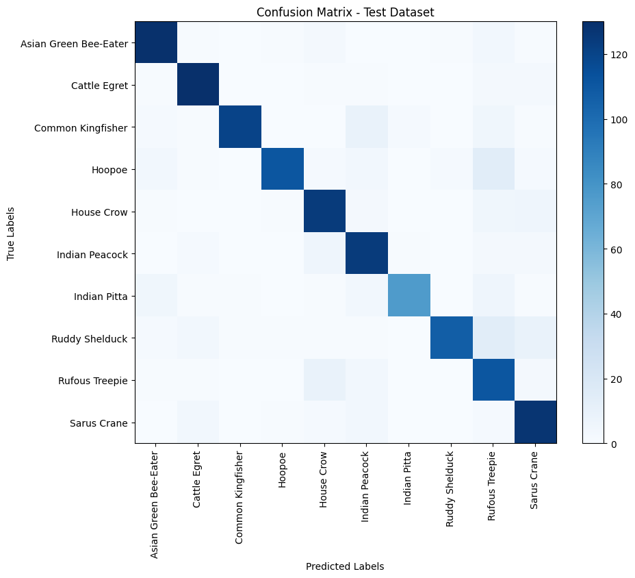
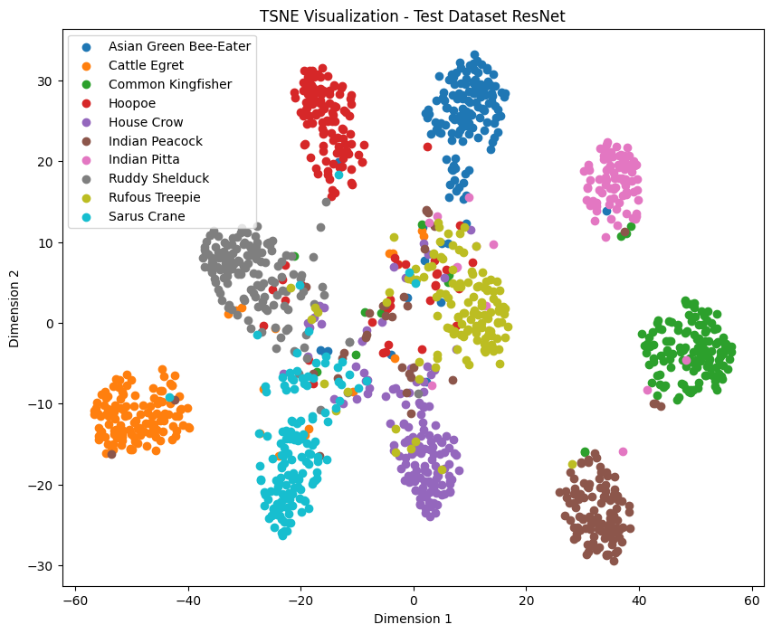
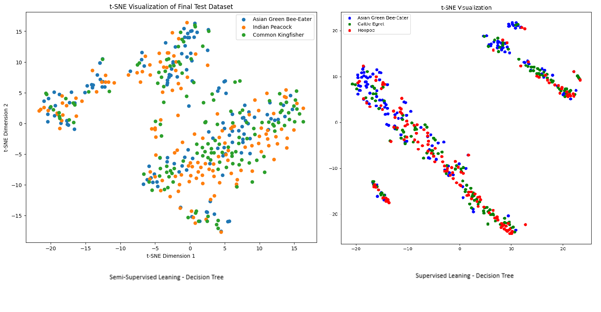

# Bird_Classification_AI_Project_COMP_6721

## Problem Statement and Introduction
<p align="justify">
Birds are a crucial component of global biodiversity, and many species are threatened or endangered. These species
are indigenous to a certain area of the nation, hence it is important to track and estimate their populations as precisely
as possible. A significant number of rare bird species have unintentionally been killed by wind turbines in various nations.
</p>

<p align="justify">
Bird species recognition is a difficult task because of the varied illumination and multiple camera view
positions. Birds differ visually significantly across and among species. Hence, it is difficult to create models that
can precisely recognize and distinguish various species as they have a variety of sizes, forms, colors, and other physical characteristics.
</p>

<p align="justify">
Our main objective is to study Machine Learning (ML) using both Decision Trees and Deep Neural Networks to address a machine learning problem from a real-world problem of identifying bird species, particularly to identify an endangering species of bird to promote broader participation in understanding and protecting the avian biodiversity, applying supervised and semi-supervised learning Classification, and comparing the performance of the different model
</p>
  
## Dataset
<p align="justify">
For this application, we have selected the dataset of Indian bird specie from Kaggle. Each photo was hand-picked and taken from the eBird Platform. A total of 22.6k photos, representing all 25 distinct bird species.
</p>
  
<p align="justify">
The given data set consists of around 925 images of 25 different kinds of species of birds. Images are taken from the bird conservation community Platform and most of them consist of 1200x800 resolution.
</p>
  
**Dataset Link: https://www.kaggle.com/datasets/arjunbasandrai/25-indian-bird-species-with-226k-images**

*Note: For our project, we have used a set of this dataset to train and evaluate our model*

<p align="justify">
For this project considering the limited computational power, we have taken the subset of the dataset evaluating the model and compared the performance.
</p>

|Model | No. of Observations | No. of Classes |
|:---:|:-------------------:|:--------------:|
|Resnet - CNN Model | 8877 | 10 |
|Desicion Tree - Supervised | 8877 | 10 |  
|Desicion Tree - Supervised (Reduced Dataset) | 2767 | 3 |
|Desicion Tree - Semi-Supervised | 2767 | 3 |

## Preprocessing the Dataset
<p align="justify">
first, download the dataset from the provided link from the Kaggle, and run the "data_preprocessing.py"
This Python script will resize the original dataset images and it will also split the dataset into test(15%), valid(15%), and train dataset(70%). adjust the split ratio as per your requirements.
</p>
  
<p align="justify">
Some of the images have incorrect sRBG format that the open-cv in Python can't interpret. so this script will remove noisy data. The deep Learning model requires a constant input dimensionality, there we have resized the original images into 224x224 fixed resolution.
</p>
  
## Experiment Setup
### Hardware Setup
<p align="justify">
Training the model requires extremely intensive processing hardware units. For this project, we have used Google Colab to get the benefits of cloud computing and high processing units. Here are the detailed specifications of the google collab hardware
</p>
  
| Name | Specification |
|:----:|:-------------:|
| GPU | Tesla T4 - 15.109 GB |
| CPU | Intel(R) Xeon(R) CPU @ 2.30GHz |
| CPU Frequency | 2000.178 MHz |
| RAM | 12.7 GB |
| Disk Space | 107.7 GB |

### Dataset Linking
<p align="justify">
Google Collab provides the functionality to directly read, and write data from your google drive, for this project, we have uploaded our training dataset on google drive, from where we read data and save the model, and evaluation matrices on google drive. in the code just provide the dataset path of your drive and authenticate the drive permission and you are ready to train your model.
</p>

## How to train and validate the model
<p align="justify">
This research examines and assesses Machine Learning (ML) tasks for real-world classification problems using the Resnet Model and Decision Tree. We have employed the decision tree for supervised and semi-supervised learning. We developed the ResNet model for the Deep Neural Network from scratch and compared its performance with the pre-trained ResNet model.
</p>

Here is the directory structure of our project.

For the training, first of all, install the required libraries given in the `requirements.txt` file. or else use the following command.
```
pip install -r requirements.txt
```
*Note: For our project, we have used the Cuda environment to train and evaluate our Deep Learning model*

<p align="justify">
Now launch Google Collab or another framework, such as Jupiter-notebook or VS Code, and open the ".ipynb" file. The training, testing, and validation dataset paths should be provided. for instance,
</p>

```
train_data_path = Path("/content/gdrive/MyDrive/AI PROJECT DATASET/train")
valid_data_path = Path("/content/gdrive/MyDrive/AI PROJECT DATASET/valid")
test_data_path = Path("/content/gdrive/MyDrive/AI PROJECT DATASET/test")
```

<p align="justify">
Here, Google Drive has been mounted in Google Collab so that the dataset can be imported for training and testing. You can choose a path for your dataset based on your environment. In this repository, we have also uploaded the collection of cleaned and preprocessed datasets. provide the location of the corresponding directory for the testing and training.
</p>

<p align="justify">
Use the 'resnet_model.pth' file from the model folder or download the model from the supplied URL below to test the DL model on a fresh dataset. The training and evaluation metrics data demonstrating the outcome of our model training and testing are included in the "graphs" folder. 
</p>

**Trained Resnet Model Link: https://drive.google.com/file/d/1vQtUnZYnJhiERQC0GV9m1MwaDedHsUFq/view?usp=drive_link**

## Results
<p align="justify">
The graph below illustrates the ResNet CNN Model's performance at each training epoch. As can be seen, model performance improves with each passing epoch, and loss also gradually decreases. Since they can properly fit the training set of data, models with smaller training loss perform better. The performance in terms of accuracy, precision, and recall significantly improves when the loss reduces, as depicted in the graph.
</p>


<P align="justify">
The distribution of Class labels using the confusion matrix is given below.
</P>

1. Confusion Matrix for the ResNet Model on Test Dataset



2. Confusion Matrix for the Decision Tree with Supervised Learning on Test Dataset


3. Confusion Matrix for the Decision Tree with Semi-Supervised Learning on Test Dataset


<p align="justify">
t-SNE is used to plot the data points' high-dimensional representations in a low-dimensional space. Here it also shows the clustering of the same class label and also helps us to identify the outliners in the dataset.  
</p>

1. tSNE plot for the ResNet Model on Test Dataset



2. tSNE plot for Decision Tree with the supervised and semi-supervised approach




